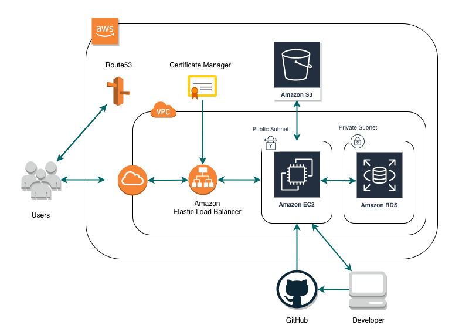

## アプリ名
「Paleo Boost(パレオブースト)」
https://paleo-engineer.com

## どんなアプリ？

パレオダイエットや地中海式ダイエットなど、 
健康に関する取り組みをしている人たちが情報交換をするコミュニティです。 
情報を共有したり計算機能を利用したりすることにより健康増進の効果を高め合うことが目的です。 

## できること(実装した機能)
- ユーザー登録・ログイン機能
- プロフィール編集機能
- 投稿の作成機能(モーダル画面,文字数カウント)
- 画像の投稿機能
- コメント機能
- 投稿とコメントの編集・削除機能
- いいね機能(非同期通信)
- 効率よく筋肉を増やすための目標摂取カロリー計算(非同期通信)
- 最速で腹筋を割るための目標摂取カロリー計算(非同期通信)
- 投稿の検索機能とページネーション
- ゲストログイン機能

## 使用技術(言語,フレームワーク,ライブラリ)
- Laravel 7.25
- PHP
- MySQL
- JavaScript(jQuery)
- Bootstrap
- Sass

## Webサーバー環境
- Apache HTTP Server
- Amazon Linux 2

## インフラ構成
AWS(VPC, EC2, ELB, RDS, S3, Route53, ACM)を使用

## テーブル構成(ER図)
